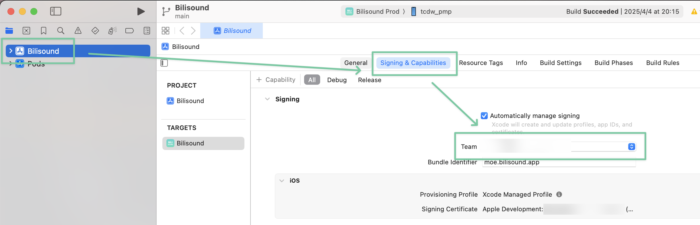
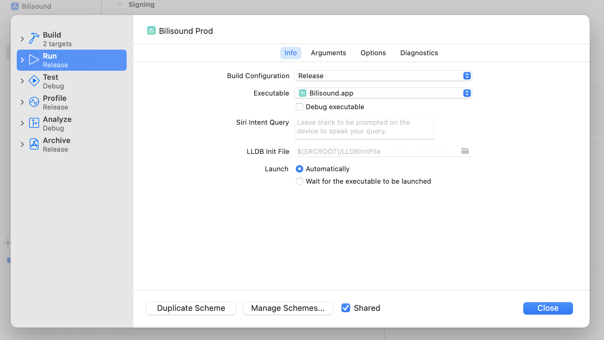

import { Aside } from '@astrojs/starlight/components';

Bilisound 是一款第三方音乐播放器，它让收听和下载音乐变得更加简单和轻松。

以下介绍不同版本客户端的安装方法。

### Android 用户

1. 访问 [GitHub Releases 最新版本页面](https://github.com/bilisound/client-mobile/releases/latest)
2. 下载 Assets 栏目中的 apk 文件
3. 在下载完成后：
   - 需进入「设置 → 安全 → 安装未知应用」启用对应应用的安装权限。
   - 部分国产安卓系统可能需要关闭「安全守护」功能。

### iOS / macOS 用户

<Aside type="caution">由于本应用没有上架 App Store，目前需要自行编译安装。此方案需要您对命令行和 Xcode 的基本使用有一定的了解。</Aside>

在开始前，确保你有一台 macOS 电脑，并正确安装了 Node.js 和 Xcode。

首先，[打开终端](https://support.apple.com/zh-cn/guide/terminal/apd5265185d-f365-44cb-8b09-71a064a42125/mac)，将应用克隆到本地：

```bash
git clone https://github.com/bilisound/client-mobile
```

然后，安装依赖，并初始化 ios 文件夹：

```bash
cd client-mobile/apps/mobile
codepack enable
pnpm install
pnpm run prebuild
```

然后，通过 Xcode 打开 `mobile` 子项目中的 ios 原生项目：

```bash
xed ios/Bilisound.xcworkspace
```

打开以后，将 Team 设置为你自己的开发者帐号：



然后，创建一个新的 Scheme，并将 Build Configuration 设置为 Release，并取消勾选 Debug executable：



最后，选择自己的手机，点击编译按钮，Bilisound 会被安装在你的手机上。

### 替代方案

📱 你可以直接使用浏览器访问 [Bilisound Web 版](https://app.bilisound.com)。

- ✅ 无需安装
- ❌ 不支持本地缓存
- ❌ 部分功能（如后台播放）将会不可靠或完全不可用（取决于你使用的浏览器和操作系统的限制）

如果条件允许，我们建议你使用 Bilisound 的手机客户端。
